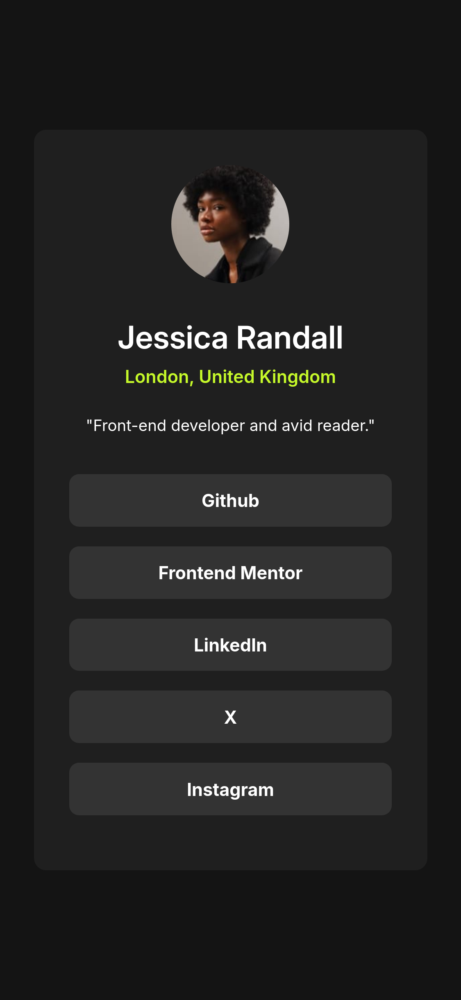
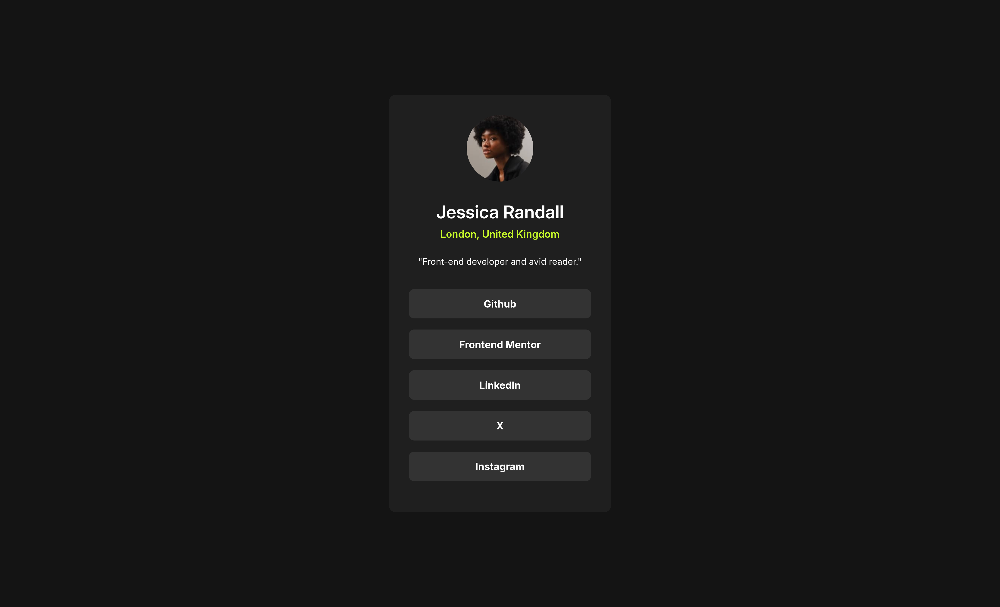

# Frontend Mentor - Social links profile solution

This is a solution to the [Social links profile challenge on Frontend Mentor](https://www.frontendmentor.io/challenges/social-links-profile-UG32l9m6dQ). Frontend Mentor challenges help you improve your coding skills by building realistic projects. 

## Table of contents

- [Overview](#overview)
  - [The challenge](#the-challenge)
  - [Screenshot](#screenshot)
  - [Links](#links)
- [My process](#my-process)
  - [Built with](#built-with)
- [Author](#author)

**Note: Delete this note and update the table of contents based on what sections you keep.**

## Overview

### The challenge

- Nicly designing social-links navigation with some personal info.

### Screenshot

### Links

- Solution URL: [Github repo](https://github.com/IbrahimMurad/social-links-profile)
- Live Site URL: [Live site](https://ibrahimmurad.github.io/social-links-profile/)

## My process

### Built with

- Semantic HTML5 markup
- CSS custom properties
- Flexbox
- CSS Grid

## Author

- Website - [Github](https://github.com/ibrahimmurad/)
- Frontend Mentor - [@IbrahimMurad](https://www.frontendmentor.io/profile/IbrahimMurad)